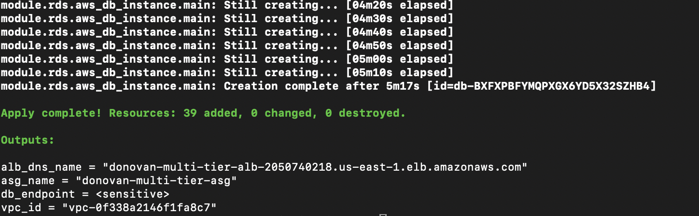
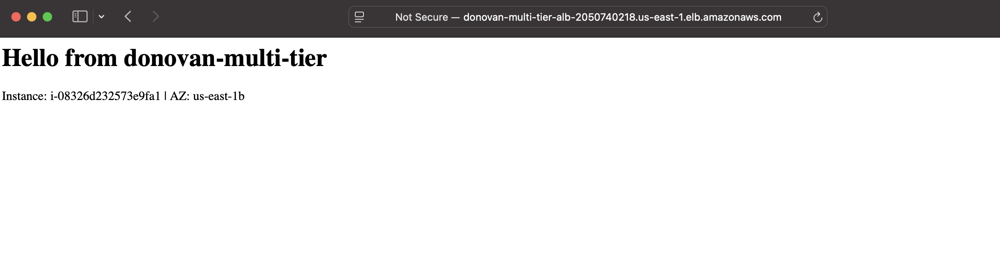
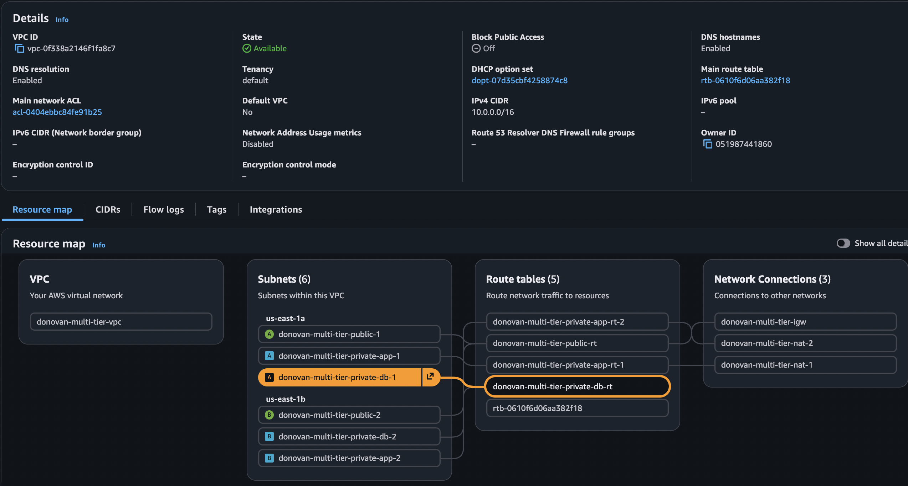
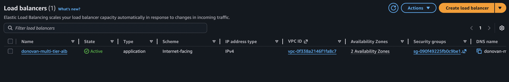
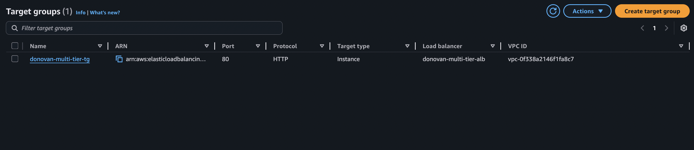
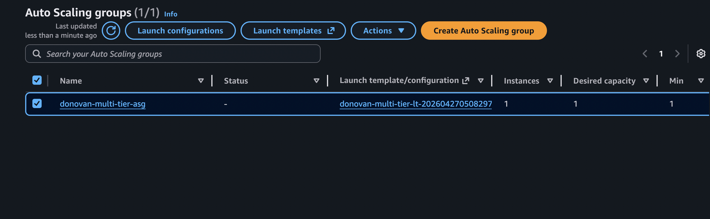
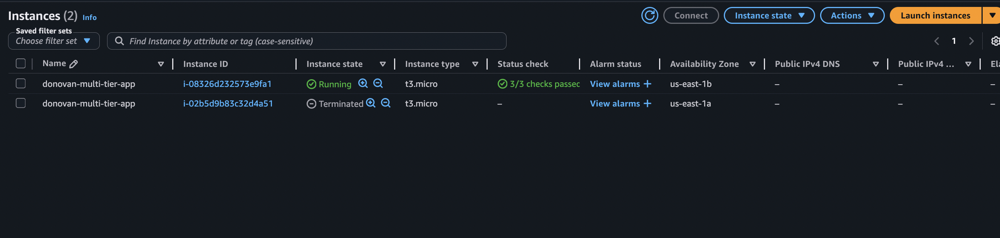
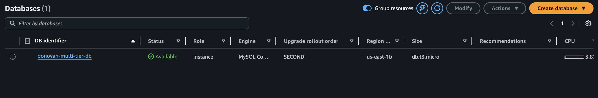
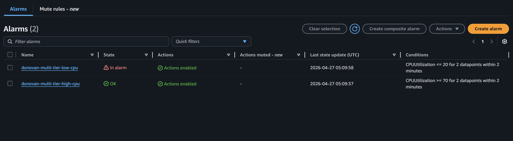
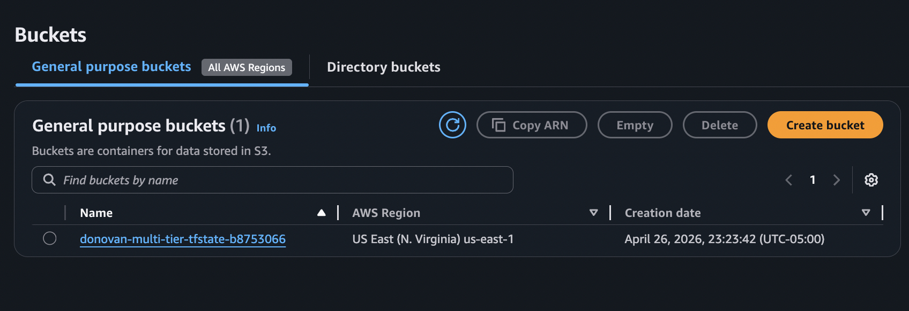

# Multi-Tier AWS Infrastructure with Terraform

Modular Terraform project deploying a production-style multi-tier AWS environment across multiple availability zones. Built as a portfolio project to demonstrate Infrastructure as Code skills for Cloud/DevOps Engineering roles.

---

## Architecture

```
Internet
   |
   v
Application Load Balancer (public subnets, us-east-1a + us-east-1b)
   |
   v
EC2 Auto Scaling Group (private app subnets, us-east-1a + us-east-1b)
   |
   v
RDS MySQL 8.0 (private DB subnets, us-east-1b)
```

**Remote state:** S3 bucket (versioned + encrypted) + DynamoDB table (state locking)

---

## Infrastructure Components

| Component | Details |
|---|---|
| VPC | 10.0.0.0/16, 6 subnets across 2 AZs |
| Public subnets | ALB, NAT Gateways (us-east-1a + us-east-1b) |
| Private app subnets | EC2 Auto Scaling Group |
| Private DB subnets | RDS MySQL 8.0 |
| ALB | Internet-facing, HTTP listener, health checks, target group |
| EC2 ASG | Launch template, min 1 / max 3 / desired 1, CloudWatch CPU scaling |
| RDS | db.t3.micro, encrypted storage, private subnet group |
| IAM | EC2 instance role with SSM access (no bastion, no port 22) |
| CloudWatch | CPU alarms triggering scale-up at 70% and scale-down at 20% |
| Remote State | S3 bucket with versioning + DynamoDB state locking |

---

## Deployment Validation

### Terraform Apply Completion

39 resources provisioned across all four modules with outputs confirming the ALB DNS name, ASG name, VPC ID, and a sensitive DB endpoint.



---

### Live Application via ALB

The application is accessible through the ALB DNS name, returning the EC2 instance ID and availability zone — confirming end-to-end routing from the internet through the load balancer to a private EC2 instance.



---

### VPC and Subnet Layout

VPC `vpc-0f338a2146f1fa8c7` with all 6 subnets visible across both AZs — public, private app, and private DB tiers — alongside 5 route tables and 3 network connections (IGW + 2 NAT Gateways).



---

### Application Load Balancer

`donovan-multi-tier-alb` deployed as an internet-facing Application Load Balancer in Active state, spanning both availability zones within the VPC.



---

### Target Group

`donovan-multi-tier-tg` registered on port 80 over HTTP, attached to the ALB and scoped to the VPC — confirming the ALB to EC2 forwarding path is wired correctly.



---

### EC2 Auto Scaling Group

`donovan-multi-tier-asg` running with the `donovan-multi-tier-lt` launch template, desired capacity of 1, min 1, and a healthy running instance passing all status checks in us-east-1b.



---

### EC2 Instance

`donovan-multi-tier-app` running as a `t3.micro` in a private subnet in us-east-1b, with no public IPv4 address assigned — accessible only through the ALB or SSM Session Manager.



---

### RDS MySQL Instance

`donovan-multi-tier-db` running MySQL Community on a `db.t3.micro` in us-east-1b with status Available — deployed in an isolated private subnet group with no public endpoint.



---

### CloudWatch Alarms

Two CPU-based alarms configured with actions enabled. The `high-cpu` alarm triggers a scale-up at 70% CPU utilization and the `low-cpu` alarm triggers a scale-down at 20%, both evaluated over 2 consecutive datapoints within a 2-minute window.



---

### S3 Remote State Bucket

`donovan-multi-tier-tfstate-b8753066` provisioned in us-east-1 via the bootstrap module to store Terraform remote state. The bucket is versioned, AES-256 encrypted, and blocks all public access — keeping infrastructure state secure and recoverable across deployments.



---

## Module Structure

```
modules/
├── vpc/    # VPC, subnets, IGW, NAT Gateways, route tables
├── alb/    # ALB, security group, target group, HTTP listener
├── ec2/    # Launch template, ASG, IAM role, CloudWatch alarms
└── rds/    # RDS instance, subnet group, security group
```

---

## Prerequisites

- [Terraform >= 1.5.0](https://developer.hashicorp.com/terraform/downloads)
- AWS CLI configured (`aws configure`)
- An AWS account with sufficient IAM permissions

---

## Deployment

### 1. Bootstrap remote state (one-time)

```bash
cd bootstrap/
terraform init
terraform apply
```

Note the two output values: `state_bucket_name` and `dynamodb_table_name`.

### 2. Configure the backend

Edit `backend.tf` with the values from the bootstrap output:

```hcl
terraform {
  backend "s3" {
    bucket         = "your-bucket-name-here"
    key            = "multi-tier/terraform.tfstate"
    region         = "us-east-1"
    dynamodb_table = "your-dynamodb-table-here"
    encrypt        = true
  }
}
```

### 3. Set your variables

```bash
cp terraform.tfvars.example terraform.tfvars
# Edit terraform.tfvars with your values — never commit this file
```

### 4. Deploy

```bash
terraform init
terraform plan
terraform apply
```

### 5. Verify

```bash
terraform output alb_dns_name
# Paste the output URL into your browser
```

### 6. Tear down

```bash
terraform destroy
```

---

## Security Highlights

- EC2 instances have no public IPs and live in private subnets
- RDS is not publicly accessible and only accepts traffic from the EC2 security group
- The ALB is the only internet-facing resource
- EC2 instances use SSM Session Manager instead of SSH (no open port 22, no key pairs needed)
- S3 state bucket is encrypted, versioned, and blocks all public access
- Sensitive outputs (DB password, endpoint) are marked `sensitive = true`

---

## Skills Demonstrated

`Terraform` `AWS VPC` `EC2 Auto Scaling` `Application Load Balancer` `RDS MySQL` `IAM` `CloudWatch` `Remote State` `S3` `DynamoDB` `Infrastructure as Code` `Multi-AZ Design`
